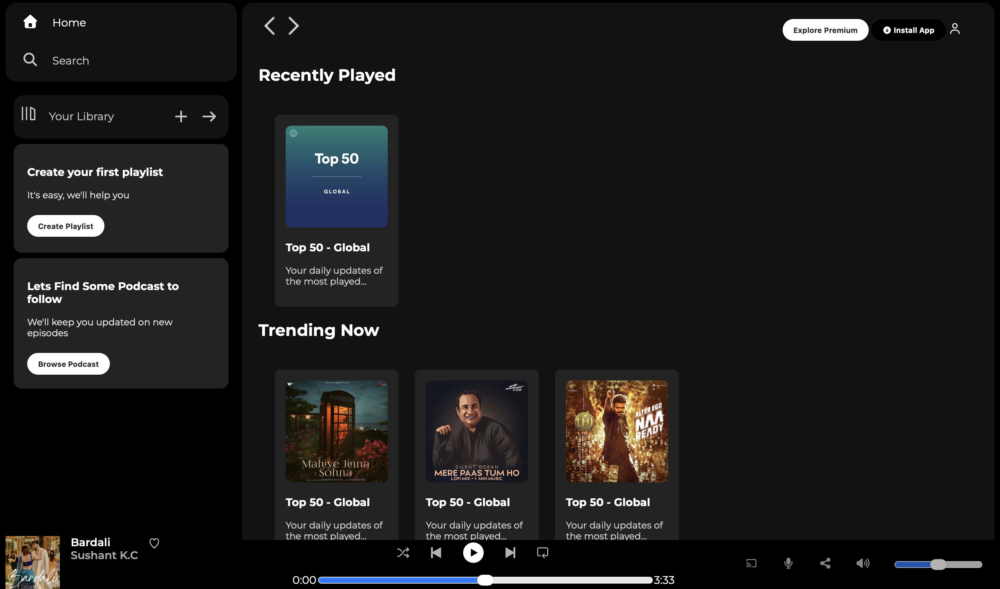
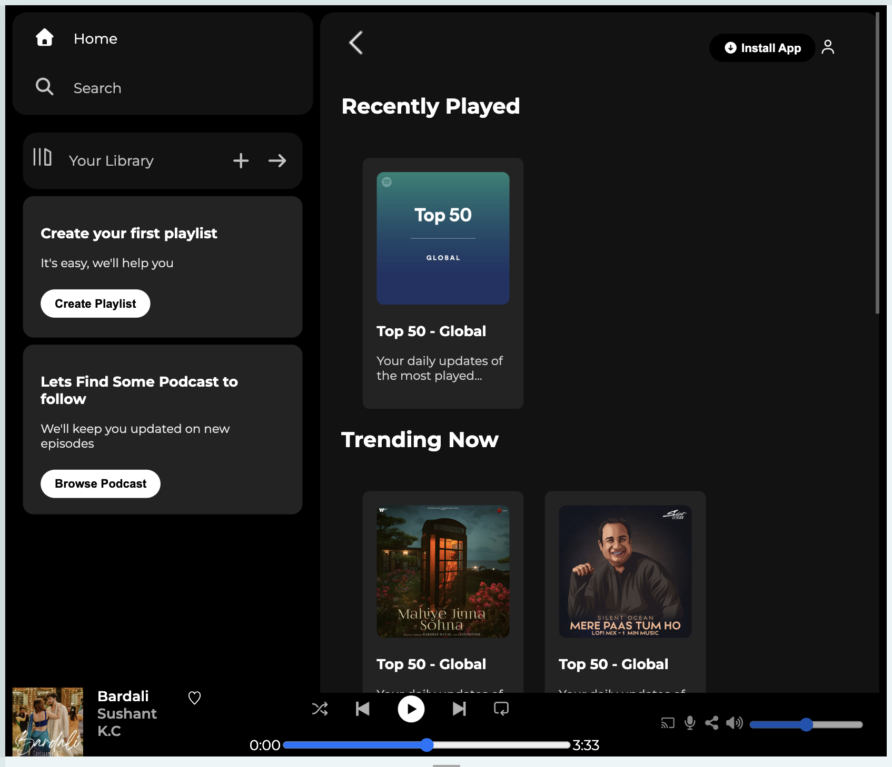
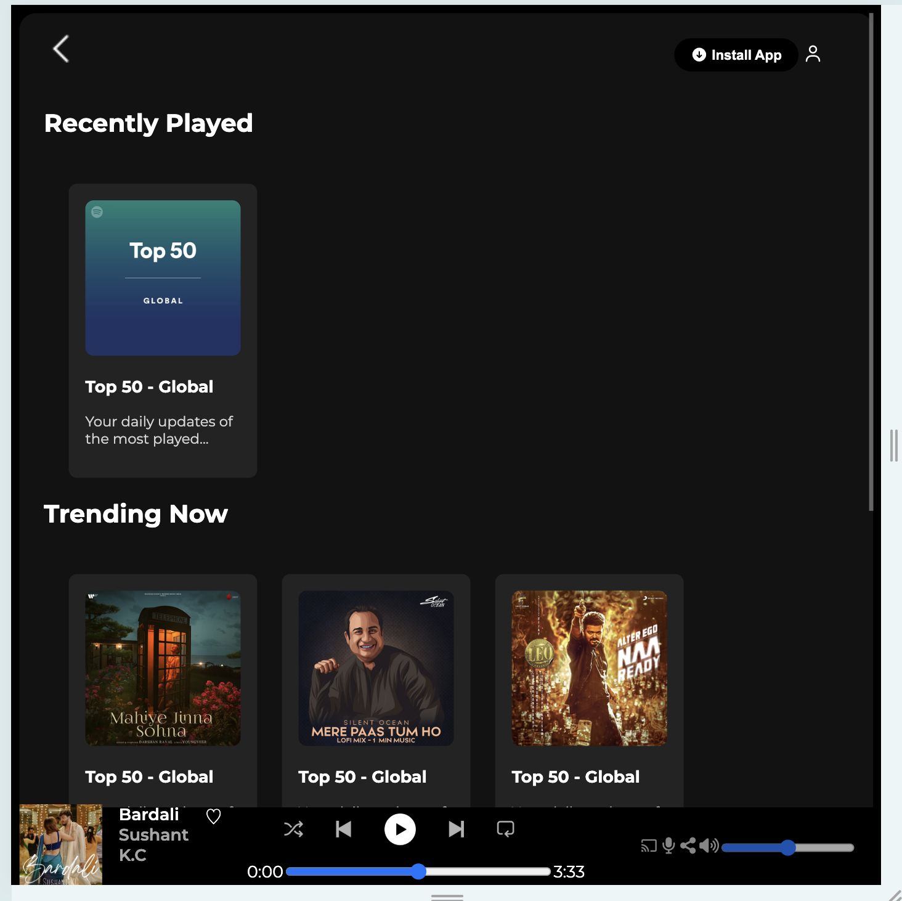

# 🎵 Spotify Clone - Web Player UI

A frontend Spotify Clone project created using **HTML and CSS**.

This project recreates the basic design and layout of the Spotify Web
Player interface, including the sidebar navigation, music cards, sticky
navigation bar, and a bottom music player section.

------------------------------------------------------------------------

## 📌 Project Overview

This is a static frontend project built to practice creating a modern
music streaming website interface.

The project focuses on:

-   Creating structured layouts using HTML
-   Styling components using CSS
-   Using Flexbox for positioning
-   Creating responsive designs
-   Working with local images and external libraries
-   Designing a user interface similar to a real-world application

------------------------------------------------------------------------

## ✨ Features

### 🏠 Sidebar Navigation

-   Home navigation option
-   Search option
-   Your Library section
-   Create Playlist card
-   Podcast recommendation card

### 🎶 Main Content Section

-   Sticky top navigation bar
-   Recently Played section
-   Trending Music section
-   Featured Charts section
-   Music cards with hover animations

### 🎧 Music Player Section

-   Currently playing song display
-   Album cover image
-   Song name and artist information
-   Playback control buttons
-   Progress bar
-   Volume and additional controls

### 📱 Responsive Design

-   Sidebar hides on smaller screens
-   Navigation adapts according to screen size
-   Flexible layout using CSS Flexbox

------------------------------------------------------------------------

## 🛠️ Technologies Used

-   HTML5
-   CSS3
-   Font Awesome Icons
-   Google Fonts (Montserrat)

------------------------------------------------------------------------

## 📁 Project Structure

    Spotify Clone/
    │
    ├── index.html
    ├── style.css
    │
    └── Picturex/
        │
        ├── logo.png
        ├── library_icon.png
        ├── backward_icon.png
        ├── forward_icon.png
        ├── player_icon1.png
        ├── player_icon2.png
        ├── player_icon3.png
        ├── player_icon4.png
        ├── player_icon5.png
        ├── card1img.jpeg
        ├── card2img.jpeg
        ├── card3img.jpeg
        ├── card4img.jpeg
        ├── card5img.jpeg
        ├── card6img.jpeg
        ├── bardali.jpg
        ├── final1.png
        ├── final2.png
        └── final3.png
        

------------------------------------------------------------------------

## 📸 Screenshots
Full Screen

Medium Size

Small Screen -without sidebar

------------------------------------------------------------------------

## 🚀 How To Run

1.  Download or clone this repository.

2.  Open the project folder.

3.  Open `index.html` in any browser.

For a better development experience, use the **Live Server** extension
in VS Code.

------------------------------------------------------------------------

## 📚 Learning Outcomes

By building this project, I practiced:

-   HTML page structuring
-   CSS styling techniques
-   Flexbox layouts
-   Responsive web design
-   Image handling
-   Creating reusable CSS classes
-   UI design implementation

------------------------------------------------------------------------

## 🔮 Future Improvements

Possible improvements:

-   Add JavaScript functionality
-   Implement real music playback
-   Add working search feature
-   Add playlist creation
-   Add dynamic song data
-   Improve mobile UI
-   Add animations and transitions

------------------------------------------------------------------------

## 👨‍💻 Author

**Prashant Paudel**

Frontend Development Learner

------------------------------------------------------------------------

## ⭐ Credits

Inspired by the Spotify Web Player design.

This project is created for educational and practice purposes only.
